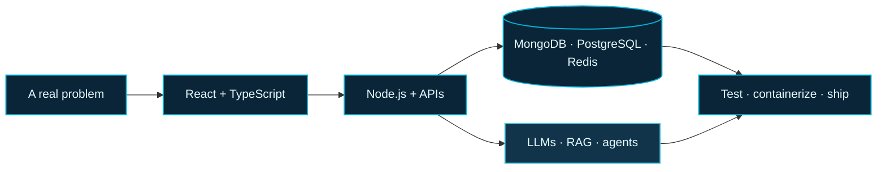

 

 

 
 

`MULTAN, PAKISTAN` &nbsp; / &nbsp; `MERN + TYPESCRIPT` &nbsp; / &nbsp; `AGENTIC AI`

---

<table>
<tr>
<td width="20%" align="center" valign="middle">

</td>
<td width="80%" valign="top">

## Full Stack Developer | MERN &amp; Agentic AI

I’m **Muhammad Shahzaib**, based in **Multan, Pakistan**. I build fast, reliable web apps and AI-powered tools that solve real problems, from customer-facing products to internal systems.

Full-stack across the whole picture: React/Node, agentic AI pipelines, real-time systems, and production deployment on AWS, Docker, and Vercel.

</td>
</tr>
</table>

## The build path

## Selected work

<table>
<tr>
<td width="54%" valign="middle">

</td>
<td width="46%" valign="top">

### AI-Powered Multi-Vendor E-Commerce Platform

A fully operational marketplace handling multi-vendor inventory, live orders, and AI-assisted product discovery.

`React.js` `Redux Toolkit` `Node.js` `Express.js` `MongoDB`

[Live project](https://ai-ecommerce-six.vercel.app/) · [Source](https://github.com/dev-mskhan/ai-ecommerce) · [Portfolio notes](https://devshahzaib.vercel.app/#work)

</td>
</tr>
</table>

<table>
<tr>
<td width="50%" valign="top">

### Dark Auction: Real-time Auction Platform

A live auction platform with real-time bidding, encrypted bid history, and background image processing.

`React.js` `Node.js` `Express.js` `MongoDB` `Redux Toolkit`

[Live project](https://dark-auction.vercel.app/) · [Source](https://github.com/dev-mskhan/dark-auction) · [Portfolio notes](https://devshahzaib.vercel.app/#work)

</td>
<td width="50%" valign="top">

### AI-Powered Customer Relationship Management

A full-stack CRM with Kanban pipelines, AI lead scoring, and automated email drafting.

`React` `Node` `Express` `MongoDB` `HuggingFace`

[Live project](https://ai-crm.vercel.app/) · [Source](https://github.com/dev-mskhan/ai-crm) · [Portfolio notes](https://devshahzaib.vercel.app/#work)

</td>
</tr>
</table>

**More context and project notes live on my [portfolio](https://devshahzaib.vercel.app).**

## Tools in my current toolkit

<table>
<tr>
<td width="25%" valign="top">

**BUILD**

`JavaScript` `TypeScript` `React.js` `Node.js` `Express.js` `Next.js` `Nest.js` `Tailwind CSS` `Material UI`

</td>
<td width="25%" valign="top">

**AI + SYSTEMS**

`Agentic AI Development` `LLM Integration` `RAG Pipelines` `Langchain` `Vector DB` `Workflow Automation` `Python` `Model Context Protocol (MCP)`

</td>
<td width="25%" valign="top">

**DATA**

`MongoDB` `Mongoose` `MySQL` `PostgreSQL` `Prisma` `Redis`

</td>
<td width="25%" valign="top">

**SHIP**

`Git` `GitHub` `Docker` `CI/CD` `Vercel` `Render` `AWS cloud`

</td>
</tr>
</table>

## A few more coordinates

<table>
<tr>
<td width="50%" valign="top">

### Experience

**Backend AI Engineer Intern** 
FLyRankAI · July 2026 – August 2026

Full-stack freelance development, from requirements through deployment.

</td>
<td width="50%" valign="top">

### Education

**BS in Information Technology** 
Bahauddin Zakariya University, Multan · 2023-2027

</td>
</tr>
</table>

---

### Have a thoughtful product problem?

I’m open to **remote roles, internships, and contract work**.

[See what I build](https://devshahzaib.vercel.app) &nbsp; · &nbsp; [Connect on LinkedIn](https://linkedin.com/in/shahzaibkhan45) &nbsp; · &nbsp; [Email me](mailto:dev.mskhan@gmail.com)

 

Built with curiosity, careful systems, and a little ocean blue.

